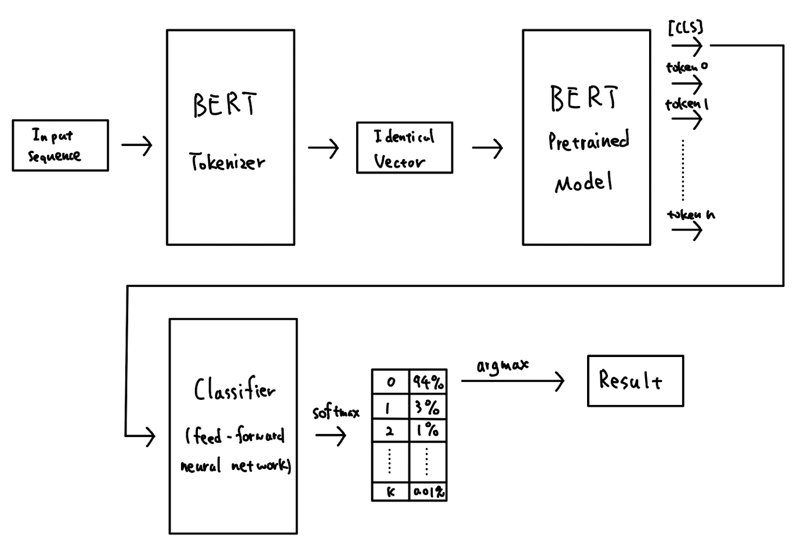

# Typo Classifier

Typo Classifier, a naive text classifier with robust to misspelled words based on `Transformers`.

The structure of Typo Classifier looks like:

This model based on BERT, and have trained on `IMDB` and `AG news` dataset. [sa.py](sa/sa.py) is a sample for Sentiment Analysis.

To see related essay, see [here](doc/essay.pdf).